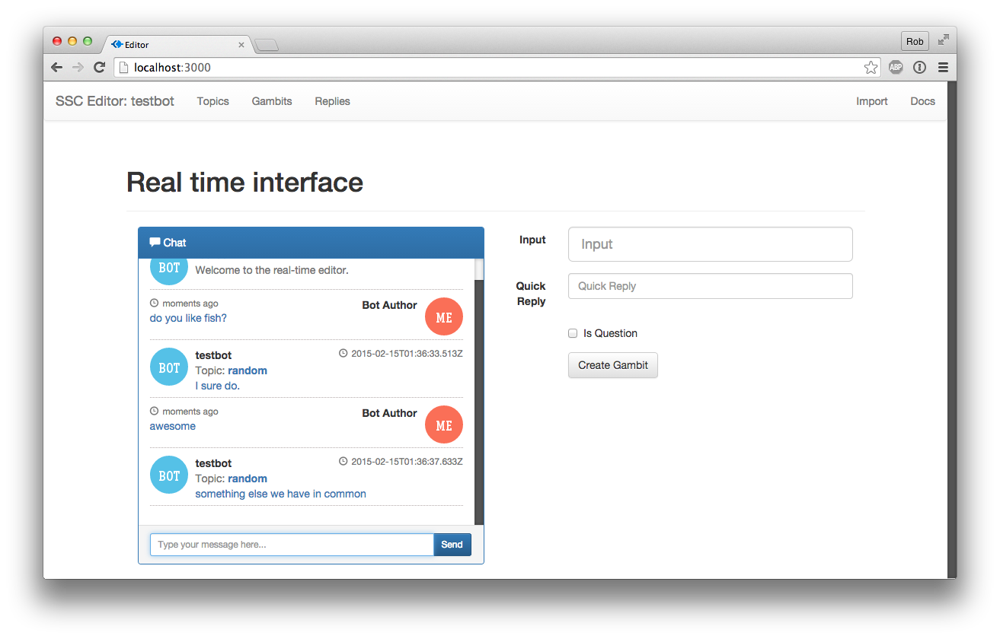
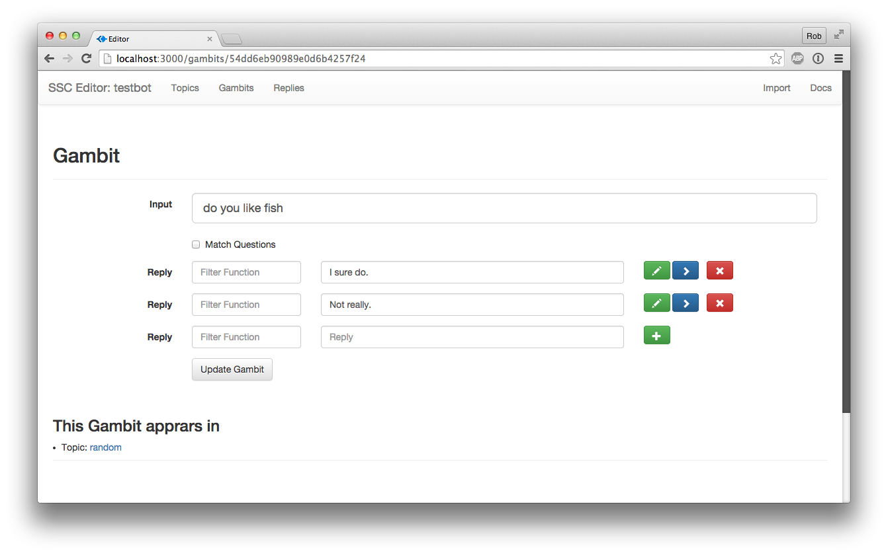

# WARNING - This project is out of date and not maintained, please use at your own risk.

# SSC Editor

An entirly new way to create chatbots using SuperScript. Featuring a built-in realtime chat interface and gambit editor.

## Install

We are assuming you have node.js 0.10.x installed and MongoDB.

    git clone https://github.com/silentrob/superscript-editor.git
    cd superscript-editor
    npm install
    npm start

    Then Open your browser to http://localhost:3000

### Further Reading

* [Introducing SuperScript](https://medium.com/@rob_ellis/superscript-ce40e9720bef) on Medium
* [Creating a Chatbot](https://medium.com/@rob_ellis/creating-a-chat-bot-42861e6a2acd) on Medium
* [Custom Slack chatbot tutorial](https://medium.com/@rob_ellis/slack-superscript-rise-of-the-bots-bba8506a043c) on Medium
* [SuperScript the big update](https://medium.com/@rob_ellis/superscript-the-big-update-3fa8099ab89a) on Medium
* [Full Documentation](http://superscriptjs.com/documentation/scripting)
* Follow [@rob_ellis](https://twitter.com/rob_ellis)

## Terminology

### Topics
I topic is the main entry point into your application. All your conversaions start within a topic depending on what exactly was said the first topic could vary. SuperScript will continue to seatch topics until it finds a matching Gambit, then replies.

### Gambits
A Gambit is a piece of information, in SuperScript it contains two parts an input and one or more replies. The input is the basis of the trigger that we match on.

### Reply
This is what is said back to the user, and is the part of a Gambit. A reply can also have a series of Gambits attached to them thus creating a thread of conversation.

## Docs

More information on using SuperScript and this Editor is available at http://superscriptjs.com. 

## License

[The MIT License (MIT)](LICENSE.md)

Copyright © 2014-2015 Rob Ellis
